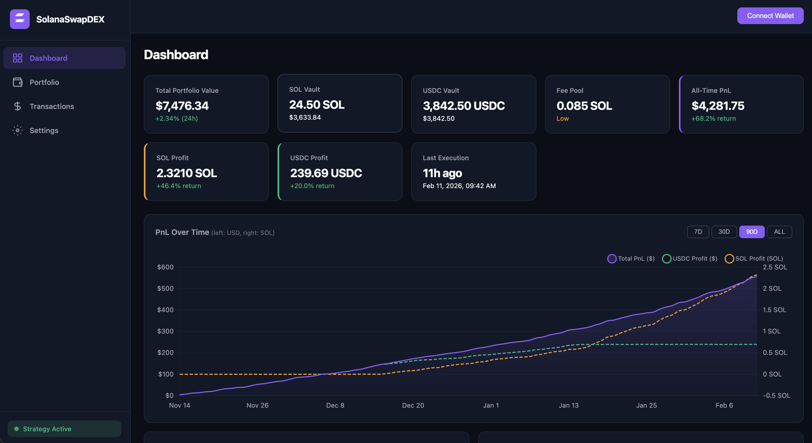

# SolanaSwapDEX

SolanaSwapDEX is a modular and efficient strategy execution system for rotating between SOL and USDC based on market signals. The architecture is designed to maximize user profits while ensuring security, scalability, and maintainability.

## Features
- **Frontend**: User-friendly interface for wallet connection, settings, and status monitoring.
- **Backend**: Robust Python services for signal ingestion, route building, and execution orchestration.
- **Relayer/Executor**: Reliable transaction handling, retry policies, and fee management.
- **On-chain Program**: Secure Rust-based implementation for vaults, fees, and Jupiter integrations.
- **Data/Indexing**: PostgreSQL database and indexer service for user state and history.
- **Monitoring**: Comprehensive tools to ensure relayer uptime, key security, and abuse prevention.

## Documentation
- [Concept Overview](documentation/concept.md)
- [Frontend Documentation](documentation/frontend.md)
- [Backend (Python) Documentation](documentation/backend-python.md)
- [Relayer/Executor Documentation](documentation/executor.md)
- [On-chain (Rust Program) Documentation](documentation/onchain.md)
- [Data/Index Documentation](documentation/dataindex.md)
- [Monitoring Documentation](documentation/monitoring.md)

## License
This project is licensed under the **MIT License**. You are free to use, modify, and distribute this code, provided that:
1. You reference this repository (https://github.com/krisztianlukacs/SolanaSwapDEX) in your project.
2. You acknowledge this base code in your source code and on your website.
